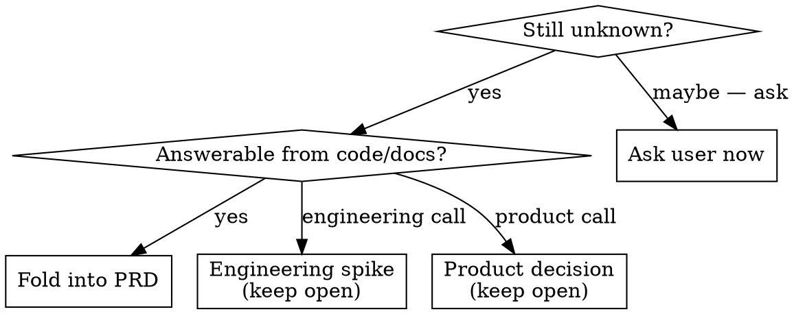

# Authoring PRDs

## Overview

A PRD is built by *interviewing*, not guessing. Explore first, ask evidence-grounded questions in batches, then write. The PRD captures *what* and *why* — implementation detail belongs in `implementation-plan.md`.

## Workflow

**1. Ask for the feature description.**
Invite the user to describe the feature freely — what it is, why it's needed, what problem it solves. Do not interrogate yet.

**1.5. Gather relevant project references.**
Note any local repositories relevant to this feature — the SPAs, services, or sibling repos it will touch or resemble. These give real code for architecture patterns, integration points, and naming — and let you *answer* questions from code that you'd otherwise leave open. **If the Step 1 brain-dump already named or linked them, capture those and move on — don't re-ask.** Only prompt the user if none were offered and the feature clearly touches code outside this repo. Captured paths become explicit grep/read targets in Step 2.

**2. Explore before asking. (Always — regardless of how detailed the brief is.)**
Read `README.md`, `product-vision.md`, and the most recent existing PRD (style reference). Grep sibling repos for prior art on technical dependencies named in the brief. Then brief the user: *"I found X already exists in Y — does it apply here?"* Also check whether the brief's proposed solution is the right one — a brief saying "add an email feature" might be solving a notification-volume problem that has a better solution. Also scan the other PRDs under `plans/`: does this feature depend on another initiative shipping first (a **prerequisite**), or share a surface or data source with one? Note candidate dependencies and confirm them in the interview, same as other prior art.

**3. Batched interview.**
Use `AskUserQuestion` in rounds of 3–5 questions. Every question must:
- Present 3–4 concrete options grounded in what you found in step 2.
- Include one explicit escape hatch: *"Unknown / defer — keep as open question."*
- State the one-line consequence of each option.

Cover this checklist across rounds: **personas, scope/non-goals, external dependencies, prerequisite/dependent initiatives (other PRDs in this repo), entitlements/access control, edge cases & failure states, success metrics, data sources, integration with existing surfaces.**

When an answer is coarse, run a targeted follow-up round immediately — do not assume specifics.

**4. Classify every remaining unknown.**

Before classifying anything as a product or engineering open question, confirm the answer isn't already established in a **sibling PRD, the product vision, a referenced design artifact, or a local repo from Step 1.5**. If it is, fold it in and record it in Resolved Decisions — open items are only for genuinely unanswerable questions.

Preserve resolved decisions in §8.1 Resolved Decisions — never delete the audit trail.

**5. Confirm the design, then write.**
Present structure and key decisions; get an explicit go-ahead before writing. Use `prd-template.md` as the skeleton.

**6. Self-review.**
Check for: implementation detail that crept in, ACs that depend on unresolved spikes (add *"degrades to … if unresolved"* notes), invented metric targets (ground them or mark *"TBD — pending baseline data"*), hardcoded assumptions that should be open questions. Also **check the draft against `product-vision.md`'s PRD alignment questions** — this is a required gate, not a mental note. Then run two final checks:
- **Dependency check:** every prerequisite or dependent initiative is named explicitly in §5 External Dependencies (marked **Prerequisite**) and the appendix.
- **Open-question audit:** re-read each §8.2 item against sibling PRDs, the product vision, design artifacts, and local repos from Step 1.5. Demote any that are now answerable into §8.1 Resolved Decisions.

**7. Invoke scope review.**
After the self-review passes, invoke `reviewing-prd-scope` on the newly written PRD file.

## PO Altitude Rule

Strip anything that describes *how* at a service/API level.

| ✅ Right level | ❌ Wrong level — move to implementation-plan.md |
|---|---|
| "Delivered via the Broadcast Service — a short message and a link" | "POST to /v1/broadcasts; message ≤ 140 chars" |
| "Paginated at 50 records per page" | "Cursor-paginated endpoint with pageSize=50 and a nextToken" |

## Common Mistakes

| Rationalization | Reality |
|---|---|
| "Auto mode says proceed — I'll draft with assumptions" | Scope-defining questions block ACs. Answer them first. |
| "I'll mark the load-bearing question open" | Open items are for genuinely unanswerable questions. Scope and persona questions must be answered before writing ACs. |
| "Documented assumptions are enough" | Documented ≠ answered. Ask, don't assume. |
| "This implementation detail provides context" | Context belongs in implementation-plan.md. Strip it. |
| "Invented metric targets are fine — format is what matters" | Ground targets in something real, or explicitly mark *"TBD — pending baseline data."* |
| "I had the product vision in mind" | "In mind" ≠ applied. The vision alignment check is a gate in step 6 — run it explicitly. |
| "The brief is detailed enough to skip the explore step" | Step 2 always runs. You need the existing PRD for style, the vision for alignment, and prior-art research to ground your questions. |
| "I'll mark this detail as an open question" | Check sibling PRDs, the product vision, and referenced design artifacts first. If the answer exists there, fold it in — open items are for genuinely unanswerable questions only. |
| "No need to mention the other PRD in §5" | If the feature can't ship until another initiative does, that's a prerequisite — name it in §5 External Dependencies (marked **Prerequisite**) and the appendix. |

## Red Flags

Any of these means you are skipping the interview — STOP:
- "I'll draft and ask questions afterward."
- "This question isn't really blocking the draft."
- "I'll assume X and document the assumption."
- "This implementation detail explains the requirement."
- "I'll mark this open" — without first checking sibling PRDs, the product vision, and referenced design artifacts.
- Wrote §5 External Dependencies without asking whether another initiative must ship first.

## Template

PRD skeleton with section-by-section guidance: `prd-template.md` in this skill directory.
