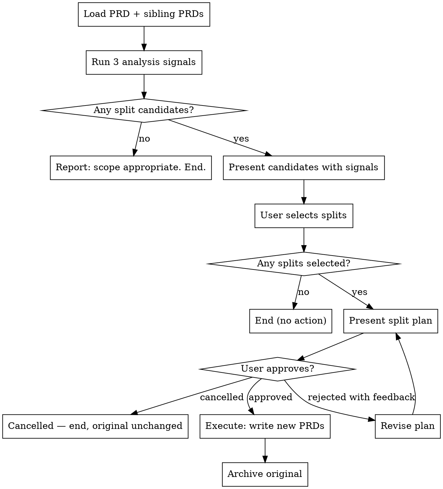

# Reviewing PRD Scope

## Overview

A PRD that bundles loosely coupled features delays delivery and obscures dependencies. This skill evaluates a written PRD against three decomposition signals and, when a split is warranted, guides you through producing complete, cross-linked replacement PRDs sequenced by dependency.

## Workflow

## Phase 1 — Analyze

Read the target PRD. Also read all sibling PRDs in the same `plans/` folder — avoid recommending a split that already exists as a separate document.

Run three signals:

**Signal A — Independent shippability.** Cluster goals, user stories, and AC groups by the feature surface they describe. For each cluster: does it reference any resource or workflow that only exists if another cluster ships first? If not, the cluster is independently shippable — a split candidate.

**Signal B — Dependency direction.** Map which clusters reference each other. A one-way dependency (A needs B; B doesn't need A) is a clean split signal — B ships as a prerequisite, A ships second. Mutual dependencies are not split candidates.

**Signal C — Scope size.** Count total user stories (S#) and ACs (AC-#). Soft thresholds: >10 stories or >20 ACs. Scope size alone does not mandate a split — it prompts closer examination of signals A and B.

## Phase 2 — Present Candidates

For each split candidate, show:
- The proposed feature grouping
- Which signal(s) flagged it, with specific evidence quoted from the PRD (e.g. "Signal A: Event Store delivers user value — S4–S6 have no dependency on tasks or points")
- The proposed dependency order (which group ships first)

Present as a checkbox list. The user selects which splits to perform, selects none (ending the skill with no action), or provides a custom grouping.

## Phase 3 — Plan

For each selected split, present:
- New PRD titles and brief scope summaries
- How user stories and AC groups will be distributed
- Explicitly flagged ambiguous content (stories or ACs that could belong to either PRD)
- The dependency chain (e.g. `PRD A (prerequisite) → PRD B`)

Ask for approval. The user may: **approve**, **reject with feedback** (revise and re-present), or **cancel** (end the skill, original unchanged).

## Phase 4 — Execute

Write each new PRD in dependency order (prerequisite first) using `prd-template.md` from the `authoring-prds` skill directory.

**Content distribution:**
- Goals, user stories, and AC groups move to the PRD that owns that feature surface
- Shared metadata (author, status, date, product area) is copied to all new PRDs
- Open questions and resolved decisions go to the PRD where they are relevant; if spanning both, place in the **prerequisite PRD** — it ships first and owns shared infrastructure decisions. In the dependent PRD's §5 row, note where the decision lives (e.g. "role model defined in the Event Store PRD").

**Ambiguity protocol:** When a story or AC could belong to either PRD, pause and ask the user — one question per ambiguous item — before continuing. Do NOT ask about shared resolved decisions; apply the prerequisite-placement rule automatically.

**Cross-linking:**
- Dependent PRD §5 External Dependencies: add the prerequisite PRD as a `**Prerequisite**` row
- Prerequisite PRD Appendix: list the dependent PRD as a related document

**Archive:** Once all new PRDs are written, move the original to `plans/archive/` (create `archive/` if it doesn't exist).

## Common Mistakes

| Mistake | Reality |
|---------|---------|
| "Signal C alone justifies the split" | Size prompts scrutiny — signals A and B make the call. A large, tightly coupled PRD stays together. |
| "I'll make silent calls on ambiguous content" | Always ask the user on ambiguous items. The approved plan was high-level; content assignment is detail the user must verify. |
| "Recommending a split that already exists" | Read sibling PRDs first. Never propose splitting off something that already has its own document. |
| "Only cross-linking the dependent PRD" | Link both ways: dependent lists prerequisite in §5; prerequisite lists dependent in Appendix. |
| "Asking the user where a shared resolved decision goes" | Apply the rule: shared resolved decisions belong in the prerequisite PRD. Only pause for ambiguous stories or ACs, never for infrastructure decisions. |
